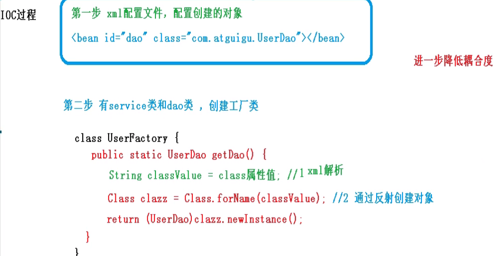

# Spring5 框架

> ## 1.Spring框架概述

> ### 1.1.简介

 	1. Spring是轻量级、开源、JavaEE的框架
 	2. Spring可以解决企业应用开发的复杂性
 	3. Spring有两个核心部分：IOC和Aop
 	 + IOC：控制反转，把创建对象的过程交给Spring进行
 	 + Aop：面向切面，不修改源代码的情况下进行功能增强

4. Spring的特点：
   + 方便解耦，简化开发
   + Aop编程支持
   + 方便程序的测试
   + 方便其他框架的整合使用
   + 降低Java EE API开发难度
   + 方便进行事务管理

5. 选择Spring5学习

> ### 1.2.准备工作

1. maven创建普通java项目

2. 编写pom.xml文件，导入Springframework，以及commons-logging依赖

   ```xml
   <dependencies>
       <dependency>
           <groupId>junit</groupId>
           <artifactId>junit</artifactId>
           <version>4.11</version>
           <scope>test</scope>
       </dependency>
       <dependency>
           <groupId>org.springframework</groupId>
           <artifactId>spring-beans</artifactId>
           <version>5.3.5</version>
       </dependency>
       <dependency>
           <groupId>org.springframework</groupId>
           <artifactId>spring-core</artifactId>
           <version>5.3.5</version>
       </dependency>
       <dependency>
           <groupId>org.springframework</groupId>
           <artifactId>spring-context</artifactId>
           <version>5.3.5</version>
       </dependency>
       <!-- https://mvnrepository.com/artifact/commons-logging/commons-logging -->
       <dependency>
           <groupId>commons-logging</groupId>
           <artifactId>commons-logging</artifactId>
           <version>1.1.1</version>
       </dependency>
       <!-- https://mvnrepository.com/artifact/commons-logging/commons-logging -->
       <dependency>
           <groupId>commons-logging</groupId>
           <artifactId>commons-logging</artifactId>
           <version>1.1.1</version>
       </dependency>
   </dependencies>
   ```

3. 创建一个测试的java类User，包含方法add();

   ```java
   package org.example;
   
   public class User {
   
       public static void add(){
           System.out.println("add");
       }
   }
   ```

4. 在main/resource目录下的创建Spring的xml配置文件，并创建对象

   ```xml
   <?xml version="1.0" encoding="UTF-8"?>
   <beans xmlns="http://www.springframework.org/schema/beans"
          xmlns:xsi="http://www.w3.org/2001/XMLSchema-instance"
          xsi:schemaLocation="http://www.springframework.org/schema/beans http://www.springframework.org/schema/beans/spring-beans.xsd">
       <!--配置User对象创建-->
       <bean id="user" class="org.example.User"></bean>
   </beans>
   ```

5. 进行单元测试

   ```java
   package org.example;
   
   import org.junit.Test;
   import org.springframework.context.ApplicationContext;
   import org.springframework.context.support.FileSystemXmlApplicationContext;
   
   public class TestSpring5 {
       @Test
       public void tsetAdd() {
           //1.加载Spring的配置文件.注意需要读取的目录路径
           ApplicationContext context = new FileSystemXmlApplicationContext("src/main/resources/applicatinContext.xml");
           //2.获取配置创建的对象
           User user = context.getBean("user",User.class);
   
           System.out.println(user);
       }
   }
   ```

   

>## 2.IOC容器

>### 2.1.IOC的底层原理

#### 2.1.1.什么是IOC（控制反转） 

1. 控制反转，把对象创建和对象之间的调用过程交给Spring进行管理
2. 使用IOC的目的： 为了降低耦合度
3. 上文的准备内容就是IOC的实现

#### 2.1.2.IOC的底层原理

1. xml解析、工厂模式、反射



1. 解析 xml文件
2. 反射加载字节码文件
3. 反射创建类的对象（强转）
> ### 2.2.IOC接口（BeanFactory）
1. IOC的思想基于IOC容器完成，IOC底层就是对象工厂
2. Spring提供IOC实现的两种方式（两个接口）
   + BeanFactory
     + IOC容器基本实现，是Spring内部使用的接口，不提供开发人员使用。
     + 加载配置文件时候不会创建对象，在获取对象(使用getBean()方法)的时候才会创建对象。
   + ApplicationContext
     + BeanFactory接口的子接口，提供更加强大的功能，一般由开发人员使用。
     + 加载配置文件的时候就会把在配置文件中的对象进行创建
3. Application接口的实现类   
         
    + FileSystemXmlApplication()添加系统的绝对路径
    + ClassPathXmlApplication() 对应项目src下开始的目录路径

> ### 2.3.Bean管理
1. 什么是Bean管理，它指的是两个操作
    1. Spring创建对象
    2. Spring的属性注入

    
> #### 2.3.1.IOC操作Bean管理（基于XML）
>1. 创建对象  
  >>    
  >> 1. 在spring配置文件中,使用bean标签,标签里面添加对应的属性,就可以实现对象的创建
  >> 2. 在bean标签中有很多属性,以下介绍常用的属性
   >>> + class ： 所需要创
   >>> + id : 获取对象的唯一标识
   >>> + name ： 可以使用特殊符号的id属性
  >> 3. 创建对象的时候默认执行无参构造
>2. 注入属性    
  >> 1. DI：依赖注入：就是属性
  >>> + 第一种注入方式：使用set方法进行注入     
  >>>> 1. 创建类：定义属性和对应的set方法
  >>>>  2. 在spring配置文件配置对象创建，配置属性注入
```xml
    <!--1.创建对象-->
    <bean id="book" class="org.example.Book">
        <!--2.set方法注入属性-->
        <!--使用property完成属性注入
            name:类里面属性的名称
            value:向属性里面注入的值
            -->
        <property name="bname" value="精神明亮的人"></property>
        <property name="bauthor" value="王开岭"></property>
    </bean>
```
  >>> + 第二种注入方式：使用有参数的构造进行注入   
  >>>>  1. 创建类：定义属性和属性对应的有参构造方法
  >>>>  2. 在spring的配置文件中配置对象创建，配置属性注入,可以通过索引值或者名称完成注入
```xml
    <!--3.利用有参构造注入属性-->
    <bean id="order" class="org.example.Order">
        <constructor-arg index="1" value="南京"/>
        <constructor-arg name="oname" value="书本"/>
    </bean>
```
  >>> + 简化操作--p名称空间注入   
        使用p名称空间注入，可以简化基于xml配置方式
  >>>>  1. 在配置文件中添加名称空间
```xml
<beans xmlns:p="http://www.springframework.org/schema/p">
    ......
</beans>
```   
  >>>> 2. 在bean标签中进行属性注入
```xml
<bean id="book" class="org.example.Book" p:bauthor="卡夫卡" p:bname="变形计"></bean>
```  
> 
  >>2. xml注入其他类型属性
   >>>1. 字面量注入: 设置属性的固定值就是字面量
   >>>> + null值   
```xml
<!--1.创建对象-->
<bean id="book" class="org.example.Book">
    <!--2.set方法注入属性-->
    <!--使用property完成属性注入： name:类里面属性的名称； value:向属性里面注入的值-->
    <property name="bauthor">
        <null/>
    </property>
</bean>
```
   >>>> + 属性值包含特殊符号   
```xml
    <bean>
    <!--属性值包含特殊符号:1. 把特殊符号进行转译2. 把特殊符号内容写入CDATA当中-->
        <property name="bname">
            <value><![CDATA[<<南京>>]]></value>
        </property>
    </bean>
```
> 
   >>>2. 外部bean注入
   >>>>a. 创建两个类Service类和dao类   
   >>>>b. 在service类调用dao里面的方法   
   >>>>c. 在spring的配置文件中进行配置
```xml
<!--创建service和dao对象标签-->
<!--内部bean-->
<bean id="emp" class="org.example.bean.Emp">
    <!--设置两个普通属性-->
    <property name="ename" value="lucy"></property>
    <property name="gender" value="女"></property>
    <!--设置对象类型属性-->
    <property name="dept">
        <!--内部bean-->
        <bean id = "dept" class="org.example.bean.Dept">
            <property name="dname" value="保安部"></property>
        </bean>
    </property>
</bean>
```
> 
   >>>3. 内部bean注入
   >>>>1.一对多关系:部门和员工 (一个部门有多个员工,一个员工属于一个部门)   
   >>>>2.在实体类中表示一对多的关系,员工体现所属部门，使用对象类型属性进行表示   
   >>>>3.在spring配置文件中进行配置
```xml
    <!--内部bean-->
    <bean id="emp" class="org.example.bean.Emp"><!--设置两个普通属性-->
        <property name="ename" value="lucy"></property>
        <property name="gender" value="女"></property>
        <!--设置对象类型属性-->
        <property name="dept">
            <!--内部bean-->
            <bean id = "dept" class="org.example.bean.Dept">
            <property name="dname" value="保安部"></property>
            </bean>
        </property>
    </bean>
```
  >>>4. 级联复制
  >>>>1. 外部bean写法
```xml
<beans>
  <!--级联赋值-->
    <bean id="emp" class="org.example.bean.Emp">
        <!--设置两个普通属性-->
        <property name="ename" value="yyin"></property>
        <property name="gender" value="男"></property>
        <!--级联赋值-->
        <property name="dept" ref="dept"></property>
    </bean>

    <bean id="dept" class="org.example.bean.Dept">
        <property name="dname" value="开发部"></property>
    </bean>
</beans>
``` 
  >>>>2.get方法的写法，注意要写对应对象的个方法
```xml
<beans>
    <!--级联赋值-->
    <bean id="emp" class="org.example.bean.Emp">
        <!--设置两个普通属性-->
        <property name="ename" value="yyin"></property>
        <property name="gender" value="男"></property>
        <!--级联赋值-->
        <property name="dept" ref="dept"></property>
        <property name="dept.dname" value="财务部"></property>
    </bean>
    <bean id="dept" class="org.example.bean.Dept">
        <property name="dname" value="开发部"></property>
    </bean>
</beans>
```  
>>>5. xml注入集合属性
>>>>a. 注入数组类型属性   
>>>>b. 注入List集合类型属性   
>>>>c. 注入Map集合     
>
>>>(1) 创建类,定义数组、list、map、set类型属性,生成对应set方法  
>>>(2) 在spring配置文件中,注入集合属性
```xml
<beans xmlns="http://www.springframework.org/schema/beans"
       xmlns:xsi="http://www.w3.org/2001/XMLSchema-instance"
       xsi:schemaLocation="http://www.springframework.org/schema/beans http://www.springframework.org/schema/beans/spring-beans.xsd">
    <!--集合类型属性注入-->
    <bean id="stu" class="collectiontype.Stu">
        <!--array类型属性注入-->
        <property name="courses">
            <array>
                <value>java课程</value>
                <value>数据库课程</value>
            </array>
        </property>
        <!--list类型属性注入-->
        <property name="list">
            <list>
                <value>yyin</value>
                <value>yiin</value>
            </list>
        </property>
        <!--map类型属性注入-->
        <property name="maps">
            <map>
                <entry key="JAVA" value="java"></entry>
                <entry key="DATABASE" value="database"></entry>
            </map>
        </property>
        <!--set型属性注入-->
        <property name="sets">
            <set>
                <value>MYSQL</value>
                <value>Redis</value>
            </set>
        </property>
    </bean>
</beans>
```
>>>6. 在集合里面设置对象类型值
```xml
    <bean>
        <property name="courseList">
            <list>
                <ref bean="course1"></ref>
                <ref bean="course2"></ref>
            </list>
        </property>
    </bean>

    <!--创建多个course对象 -->
    <bean id="course1" class="collectiontype.Course">
        <property value="Spring5框架" name="cname"></property>
    </bean>
    <!--创建多个course对象 -->
    <bean id="course2" class="collectiontype.Course">
        <property value="MyBatis框架" name="cname"></property>
    </bean>
```
>>>7. 提取集合注入内容
>>>>(1)在spring配置文件中引入名称空间util
```xml
<?xml version="1.0" encoding="UTF-8"?>
<beans xmlns="http://www.springframework.org/schema/beans"
       xmlns:xsi="http://www.w3.org/2001/XMLSchema-instance"
       xmlns:utils="http://www.springframework.org/schema/utils"
       xsi:schemaLocation="http://www.springframework.org/schema/beans 
                            http://www.springframework.org/schema/beans/spring-beans.xsd 
                            http://www.springframework.org/schema/context 
                            https://www.springframework.org/schema/utils/spring-utils.xsd">
```
>>>>(2)使用util标签完成list集合注入提取
```xml
<!--1 提取list集合类型属性注入-->
<utils:list id="bookList">
    <value>liunx</value>
    <value>mac</value>
    <value>windows</value>
</utils:list>>
<!--2 提取list集合类型属性注入-->
<bean id="book" class="...">
    <property name="list" ref="bookList"></property>
</bean>
```
>>>8. FactoryBean
>>>>Spring有两种bean，一种普通bean，另一种工厂bean()
>>>>> 普通bean：定义的bean类型就是返回类型  
>>>>> 工厂bean：在配置文件定义bean类型可以和返回类型不相同   
>>>> (1)创建类，让这个类作为工厂bean,实现接口FactoryBean   
>>>> (2)实现接口里面的方法，在实现的方法中定义返回的bean类型
>>>9. bean的作用域     
>>>>在Spring里面，设置创建的bean实例可以是一个单实例（对象的地址相同），还可以是一个多实例  
    在Spring里面，默认情况下，bean是一个单示例对象  
    那么如何设置对象是单实例还是多实例？    
(1)在spring配置文件中可以通过scope属性进行设置   
(2)scope属性值：   
a. 默认值 singleton 表示单示例对象 (预加载创建单独对象)
b. prototype 表示是多实例对象 (使用getBean()方法时,创建一个新的对象) 
c. request 请求 session 对话
```xml
<bean id="book" class="..." scope="prototype">
    <property name="list" ref="booklist"></property>
</bean>
```
> 
>>>10. bean的生命周期   
>>>> 1、生命周期 ：从对象创建到对象销毁的过程     
>>>> 2、bean 生命周期   
>>>>>（1）通过构造器创建 bean 实例（无参数构造）  
（2）为 bean 的属性设置值和对其他 bean 引用（调用 set 方法）  
（3）调用 bean 的初始化的方法（需要进行配置初始化的方法）  
（4）bean 可以使用了（对象获取到了）  
（5）当容器关闭时候，调用 bean 的销毁的方法（需要进行配置销毁的方法）      
 
>>>>3、演示 bean 生命周期 ：
```java
public class Orders {
    //无参数构造
     public Orders() {
         System.out.println("第一步 执行无参数构造创建 bean 实例");
     }
     private String oname;
     public void setOname(String oname) {
         this.oname = oname;
         System.out.println("第二步 调用 set 方法设置属性值");
     }
     //创建执行的初始化的方法
     public void initMethod() {
         System.out.println("第三步 执行初始化的方法");
     }
     //创建执行的销毁的方法
     public void destroyMethod() {
         System.out.println("第五步 执行销毁的方法");
     }
}
        
        
public class MyBeanPost implements BeanPostProcessor {//创建后置处理器实现类
    @Override
    public Object postProcessBeforeInitialization(Object bean, String beanName) throws BeansException {
        System.out.println("在初始化之前执行的方法");
        return bean;
    }
    @Override
    public Object postProcessAfterInitialization(Object bean, String beanName) throws BeansException {
        System.out.println("在初始化之后执行的方法");
        return bean;
    }
}


```
```xml
<!--配置文件的bean参数配置-->
<bean id="orders" class="com.atguigu.spring5.bean.Orders" init-method="initMethod" destroy-method="destroyMethod">	<!--配置初始化方法和销毁方法-->
    <property name="oname" value="手机"></property><!--这里就是通过set方式（注入属性）赋值-->
</bean>

<!--配置后置处理器-->
<bean id="myBeanPost" class="com.atguigu.spring5.bean.MyBeanPost"></bean>

```
>>>> 4、bean 的后置处理器，bean 生命周期有七步 （正常生命周期为五步，而配置后置处理器后为七步）   
>>>>>（1）通过构造器创建 bean 实例（无参数构造）  
（2）为 bean 的属性设置值和对其他 bean 引用（调用 set 方法）  
（3）把 bean 实例传递 bean 后置处理器的方法 postProcessBeforeInitialization   
（4）调用 bean 的初始化的方法（需要进行配置初始化的方法）  
（5）把 bean 实例传递 bean 后置处理器的方法 postProcessAfterInitialization   
（6）bean 可以使用了（对象获取到了）   
（7）当容器关闭时候，调用 bean 的销毁的方法（需要进行配置销毁的方法）   

>>>10. IOC 操作 Bean 管理(外部属性文件)

    方式一：直接配置数据库信息 ：（1）配置Druid（德鲁伊）连接池 （2）引入Druid（德鲁伊）连接池依赖 jar 包
```xml
<!--直接配置连接池-->
    <bean id="dataSource" class="com.alibaba.druid.pool.DruidDataSource">
        <property name="driverClassName" value="com.mysql.jdbc.Driver"></property>
        <property name="url" value="jdbc:mysql://localhost:3306/userDb"></property>
        <property name="username" value="root"></property>
        <property name="password" value="root"></property>
    </bean>
```
    方式二：引入外部属性文件配置数据库连接池

    （1）创建外部属性文件，properties 格式文件，写数据库信息（jdbc.properties）
```xml
    prop.driverClass=com.mysql.jdbc.Driver
    prop.url=jdbc:mysql://localhost:3306/userDb
    prop.userName=root
    prop.password=root
```
（2）把外部 properties 属性文件引入到 spring 配置文件中 —— 引入 context 名称空间
```xml
<beans xmlns="http://www.springframework.org/schema/beans"
xmlns:xsi="http://www.w3.org/2001/XMLSchema-instance"
xmlns:context="http://www.springframework.org/schema/context"
xsi:schemaLocation="http://www.springframework.org/schema/beans http://www.springframework.org/schema/beans/spring-beans.xsd
http://www.springframework.org/schema/context http://www.springframework.org/schema/context/spring-context.xsd"><!--引入context名称空间-->

        <!--引入外部属性文件-->
    <context:property-placeholder location="classpath:jdbc.properties"/>

    <!--配置连接池-->
    <bean id="dataSource" class="com.alibaba.druid.pool.DruidDataSource">
        <property name="driverClassName" value="${prop.driverClass}"></property>
        <property name="url" value="${prop.url}"></property>
        <property name="username" value="${prop.userName}"></property>
        <property name="password" value="${prop.password}"></property>
    </bean>

</beans>
```
 #### 2.3.2.IOC操作Bean管理（基于注释）
>>什么是注解？
> 
>（1）注解是代码的特殊标记，格式@注解名称（属性名称=属性值，属性名称=属性值...）  
>（2）使用注解，注解作用在类上面，方法上面，属性上面   
>（3）使用注解的目的：简化xml配置
> 
>>Spring针对Bean管理中创建对象提供注解
> 
> 下面四个注解功能相同，都可以用来创建bean实例
> @Component、@Service、@Controller、@Repository  
> 
1.  基于注解方式实现对象创建  
> 
> （1）引入依赖（引入spring-aop jar包）  
> （2）开启组件扫描 
```xml
    <!--开启组件扫描 ：如果扫描多个包
    1.多个包使用逗号隔开
    2. 扫描包上层目录-->
    <context:component-scan base-package="..."></context:component-scan>
```
> (3)创建类，在类上面添加对象注解
```java
//在注解里面value 属性可以省略不写
//默认值是类名称,首字母小写
//UserService -- userService
@Component(value ="userService") //注解等同于xml配置文件：<bean id="userService" class=""></bean>
public class UserService {
    public void add(){
        System.out.println("Service add ...");
    }
}
```
> (4)开启组件扫描的细节配置
```xml
<!--示例 1
 use-default-filters="false" 表示现在不使用默认 filter，自己配置 filter
 context:include-filter ,设置扫描哪些内容
-->
<context:component-scan base-package="com.atguigu" use-defaultfilters="false">
 <context:include-filter type="annotation"

expression="org.springframework.stereotype.Controller"/><!--代表只扫描Controller注解的类-->
</context:component-scan>
<!--示例 2
 下面配置扫描包所有内容
 context:exclude-filter： 设置哪些内容不进行扫描
-->
<context:component-scan base-package="com.atguigu">
 <context:exclude-filter type="annotation"

expression="org.springframework.stereotype.Controller"/><!--表示Controller注解的类之外一切都进行扫描-->
</context:component-scan>

```
2. 基于注解方式注入属性
>> (1)@Autowired: 根据类型进行自动装配 
> 
> 第一步 把service和dao对象创建,在service和到类添加创建对象的注解   
> 第二步 在service注入到对象,在service类添加dao类型属性.在属性上使用注解    
```java
@Service
public class UserService {
 //定义 dao 类型属性
 //不需要添加 set 方法
 //添加注入属性注解
 @Autowired
 private UserDao userDao;
 public void add() {
 System.out.println("service add.......");
 userDao.add();
 }
}

//Dao实现类
@Repository
//@Repository(value = "userDaoImpl1")
public class UserDaoImpl implements UserDao {
    @Override
    public void add() {
        System.out.println("dao add.....");
    }
}
```
>> (2)@Qualifier:根据名称进行注入    
>这个Qualifier注解可以和上面的@Autowired一起使用
```java
//定义 dao 类型属性
//不需要添加 set 方法
//添加注入属性注解
@Autowired //根据类型进行注入
//根据名称进行注入（目的在于区别同一接口下有多个实现类，根据类型就无法选择，从而出错！）
@Qualifier(value = "userDaoImpl1")
private UserDao userDao;

```
>> (3)Resource:可以根据类型注入，也可以根据名称注入
```java
//@Resource //根据类型进行注入
@Resource(name = "userDaoImpl1") //根据名称进行注入
private UserDao userDao;
```
>> (4)@Value:注入普通类型属性
```java
@Value(value = "abc")
private String name
```
>> (5)完全注解开发   
>
> 1)创建配置类,替代xml配置文件    
> @Configuration 修饰类为配置类    
> @ComponentScan(basePackages={"..."}) 配置扫描路径   
```java
@Configuration //作为配置类，替代 xml 配置文件
@ComponentScan(basePackages = {"com.atguigu"})
public class SpringConfig {
    .....
}

```
>>测试类
```java
@Test
public void testService2() {
 //加载配置类
 ApplicationContext context
 = new AnnotationConfigApplicationContext(SpringConfig.class);
 UserService userService = context.getBean("userService",
UserService.class);
 System.out.println(userService);
 userService.add();
}

```
> ## 3.Aop（Aspect Oriented Programming）
1. 面向切面编程（方面），利用AOP可以对业务逻辑的各个部分进行隔离,从而使得业务逻辑各个部分之间的耦合度降低,提高程序的复用性,同时提高了了开发的效率
2. 通俗表述**不通过修改源代码的方式，在主干功能里面添加新功能**
3. 使用登录例子说明AOP     

>AOP的底层原理   
> a. AOP底层使用动态代理，动态代理有两种情况    
>> 第一种有接口情况，使用JDK动态代理   
    
>> 第二种没有接口情况，使用CGLIB动态代理    
>   创建子类的代理对象，增强类的方法

### AOP(JDKProxy)底层代码
1. 使用JDK动态代理，使用Proxy类里面的方法创建代理对象

```java.lang.reflect```有一个Proxy类

> (1)调用newProxyInstance静态方法
```java
public static Object newProxyInstance(ClassLoader loader,
        Class<?>[] interfaces,
        InvocationHandler h)

```
 
|参数|描述|
|:---|:---|
|ClassLoader loader|类加载器|
|Object [] interfaces|增强方法所在的类，这个类实现的接口，支持多个接口|
|InvocationHandler h|实现接口InvokationHandler，创建代理对象，写增强的方法|

> (2)JDKDynamicProxy原理

(1)创建接口，定义方法
(2)创建接口实现类,实现方法
(3)使用Proxy类创建接口代理对象
```java
package aop;

import java.lang.reflect.InvocationHandler;
import java.lang.reflect.Method;
import java.lang.reflect.Proxy;
import java.util.Arrays;

/**
 * @Author: YinZhihao
 * @Description:
 * @Date: Created in 17:01 2022/1/5
 */
public class JDKProxy {
    public static void main(String[] args) {
        //接口类
        Class[] interfaces = {UserDao.class};
        //
        UserDaoImpl userDao = new UserDaoImpl();
        //创建接口实现类的代理对象
        UserDao dao = (UserDao) Proxy.newProxyInstance(JDKProxy.class.getClassLoader(), interfaces, new UserDaoProxy(userDao));
        System.out.println(dao.add(2, 3));
        System.out.println(dao.update("123"));
    }


}
//创建代理对象代码，增强类
class UserDaoProxy implements InvocationHandler {
    //1.把代理对象指向的实现类传递过来
    //有参数构造传递
    private Object obj;
    public UserDaoProxy(Object  obj){
        this.obj=obj;
    }
    //增强的逻辑
    @Override
    public Object invoke(Object proxy, Method method, Object[] args) throws Throwable {
        //方法之前
        System.out.println("在方法之前执行"+method.getName()+":传递的参数..."+ Arrays.toString(args));

        //被增强方法执行
        Object res = method.invoke(obj, args);

        //方法之后
        System.out.println("在方法之后执行..."+obj);

        return res;
    }
}
```
###  AOP 术语
 a）连接点：类里面哪些方法可以被增强，这些方法称为连接点

 b）切入点：实际被真正增强的方法称为切入点

 c）通知（增强）：实际增强的逻辑部分称为通知，且分为以下五种类型：

 1）前置通知   
 2）后置通知   
 3）环绕通知   
 4）异常通知   
 5）最终通知

 d）切面：把通知应用到切入点过程
 ### AOP Spring的实践
 1. Spring框架一般基于ASpectJ实现
> 什么是AspectJ    
> AspectJ不是spring组成部分,它是独立的AOP框架,一般把AspectJ和Spring框架一起使用,进行AOP的相关操作。

2.基于AspectJ实现AOP操作 
>(1)基于xml配置文件实现   
 (2)基于注解方式实现(通常使用)
3. 在项目工程中引入切入点表达式的作用:   
> 知道对哪个类里面的哪个方法进行增强
>> 语法结构
> 
>execution([权限修饰符][返回类型][类全路径][方法名称]  ([参数列表]))
```java
//（3）例子如下：
//例 1：对 com.atguigu.dao.BookDao 类里面的 add 进行增强
execution(* com.atguigu.dao.BookDao.add(..))
//例 2：对 com.atguigu.dao.BookDao 类里面的所有的方法进行增强
execution(* com.atguigu.dao.BookDao.* (..))
// 例 3：对 com.atguigu.dao 包里面所有类，类里面所有方法进行增强
execution(* com.atguigu.dao.*.* (..))
```
```java
//4、配置不同类型的通知
@Component
@Aspect  //生成代理对象
public class UserProxy {
      //相同切入点抽取
    @Pointcut(value = "execution(* com.atguigu.spring5.aopanno.User.add(..))")
    public void pointdemo() {

    }

    //前置通知
    //@Before注解表示作为前置通知
    @Before(value = "pointdemo()")//相同切入点抽取使用！
    public void before() {
        System.out.println("before.........");
    }

    //后置通知（返回通知）,又返回值后才执行，所以存在异常不执行
    @AfterReturning(value = "execution(* com.atguigu.spring5.aopanno.User.add(..))")
    public void afterReturning() {
        System.out.println("afterReturning.........");
    }

    //最终通知
    @After(value = "execution(* com.atguigu.spring5.aopanno.User.add(..))")
    public void after() {
        System.out.println("after.........");
    }

    //异常通知
    @AfterThrowing(value = "execution(* com.atguigu.spring5.aopanno.User.add(..))")
    public void afterThrowing() {
        System.out.println("afterThrowing.........");
    }

    //环绕通知
    @Around(value = "execution(* com.atguigu.spring5.aopanno.User.add(..))")
    public void around(ProceedingJoinPoint proceedingJoinPoint) throws Throwable {
        System.out.println("环绕之前.........");

        //被增强的方法执行
        proceedingJoinPoint.proceed();

        System.out.println("环绕之后.........");
    }
}
```
4.重用切入点的定义(抽取切入点)   
```java
//相同切入点抽取
    @Pointcut(value = "execution(* aopAnno.User.add(..))")
    public void pointdemo(){
        ......
    }
    @Before(value="pointdemo()")
    public void  before (){
        System.out.print("....");
    }
```
5.有多个增强类对同一个方法进行增强，设置增强类优先级      
可以子啊增强类的上面添加一个注解作为前置通知,数字值越小越优先
```java
@Component
@Aspect
@Order(1)
public class PersonProxy{ }
```
6.配置文件方式实践
````xml
<!--1、创建两个类，增强类和被增强类，创建方法（同上一样）-->
<!--2、在 spring 配置文件中创建两个类对象-->
<!--创建对象-->
<bean id="book" class="com.atguigu.spring5.aopxml.Book"></bean>
<bean id="bookProxy" class="com.atguigu.spring5.aopxml.BookProxy"></bean>
<!--3、在 spring 配置文件中配置切入点-->
<!--配置 aop 增强-->
<aop:config>
 <!--切入点-->
 <aop:pointcut id="p" expression="execution(* com.atguigu.spring5.aopxml.Book.buy(..))"/>
 <!--配置切面-->
 <aop:aspect ref="bookProxy">
 <!--增强作用在具体的方法上-->
 <aop:before method="before" pointcut-ref="p"/>
 </aop:aspect>
</aop:config>


````
> ## 4.JDBCTemplate
> 
> ## 5.事务管理

> ## 6.Spring5新特性

